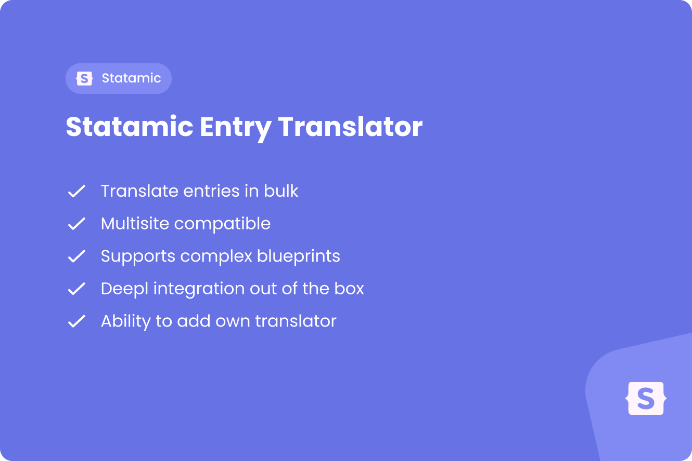

<a href="https://justbetter.nl" title="JustBetter">
    
</a>

# Statamic Entry Translator

<p>
    <a href="https://github.com/justbetter/statamic-entry-translator"></a>
    <a href="https://github.com/justbetter/statamic-entry-translator"></a>
    <a href="https://github.com/justbetter/statamic-entry-translator"></a>
    <a href="https://github.com/justbetter/statamic-entry-translator"></a>
</p>

Automatically translate the content of Statamic entries and global sets using translation services.

## Features

This package provides a seamless way to translate Statamic entries and global sets to different sites and locales using translation services.

Features:

- Translate entries and global sets to multiple sites/locales
- Support for DeepL translation service
- Queue-based translation processing
- Configurable field exclusions
- Handles nested fields, replicators, and fieldset imports
- Statamic CP actions for easy entry and global set translation
- Only translates localizable fields
- Automatically creates entry localizations if they don't exist

> Also check out our other [Statamic packages](https://github.com/justbetter?q=statamic)!

## Installation

Require this package:

```bash
composer require justbetter/statamic-entry-translator
```

Publish the config:

```bash
php artisan vendor:publish --tag=justbetter-statamic-entry-translator
```

The config file will be located at `config/justbetter/statamic-entry-translator.php`.

> **_TIP:_** All translations in this package are run via jobs, we recommend Laravel Horizon or another queueing system to run these.

## Setup

### DeepL Configuration

Add your DeepL authentication key to your `.env` file:

```dotenv
DEEPL_AUTH_KEY=your-deepl-auth-key-here
```

If you're using DeepL's free tier or a specific server, you can optionally set the server URL:

```dotenv
DEEPL_SERVER_URL=https://api-free.deepl.com
```

### Queue Configuration

By default, translations are processed on the `default` queue. You can configure this in the config file:

```php
<?php

return [
    'queue' => 'translations', // Use a dedicated queue for translations
    // ...
];
```

### Field Exclusions

You can exclude specific field handles or field types from being translated in the config file:

```php
<?php

return [
    'excluded_handles' => [
        'id',
        'type',
        'slug', // Exclude slug from translation
    ],

    'excluded_types' => [
        'select',
        'assets',
        'entries',
        'users', // Exclude user fields
    ],
];
```

## Usage

### Using the Statamic CP Action

#### Entries

1. Navigate to your entries in the Statamic Control Panel
2. Select one or more entries you want to translate
3. Click on the "Actions" dropdown
4. Select "Translate Content"
5. Choose the target sites you want to translate to
6. Click "Run"

#### Global Sets

1. Navigate to your global sets in the Statamic Control Panel
2. Select a global set you want to translate
3. Click on the "Actions" dropdown
4. Select "Translate Content"
5. Choose the target sites you want to translate to, or select "All sites"
6. Click "Run"

The translations will be queued and processed asynchronously.

### Programmatic Usage

You can also translate entries programmatically:

```php
use JustBetter\EntryTranslator\Facades\TranslateEntry;
use Statamic\Facades\Entry;
use Statamic\Facades\Site;

$entry = Entry::find('entry-id');
$targetSite = Site::get('en');

TranslateEntry::translate($entry, $targetSite);
```

### Translating Multiple Entries

To translate an entry to multiple sites:

```php
use JustBetter\EntryTranslator\Facades\TranslateEntries;
use Statamic\Facades\Entry;
use Statamic\Facades\Site;

$entry = Entry::find('entry-id');
$sites = Site::all()->filter(fn($site) => $site->handle() !== $entry->site()->handle());

TranslateEntries::translateEntries($entry, $sites);
```

### Translating Global Sets

To translate a global set to a single site:

```php
use JustBetter\EntryTranslator\Facades\TranslateGlobalSet;
use Statamic\Facades\GlobalSet;
use Statamic\Facades\Site;

$globalSet = GlobalSet::find('settings');
$sourceSite = Site::get('en');
$targetSite = Site::get('nl');

TranslateGlobalSet::translate($globalSet, $sourceSite, $targetSite);
```

To translate a global set to multiple sites:

```php
use JustBetter\EntryTranslator\Facades\TranslateGlobalSets;
use Statamic\Facades\GlobalSet;
use Statamic\Facades\Site;

$globalSet = GlobalSet::find('settings');
$sourceSite = Site::get('en');
$targetSites = Site::all()->filter(fn ($site) => $site->handle() !== $sourceSite->handle());

TranslateGlobalSets::translateGlobalSets($globalSet, $sourceSite, $targetSites);
```

### Using Jobs Directly

You can dispatch translation jobs directly:

```php
use JustBetter\EntryTranslator\Jobs\TranslateEntryJob;
use JustBetter\EntryTranslator\Jobs\TranslateGlobalSetJob;
use Statamic\Facades\Entry;
use Statamic\Facades\GlobalSet;
use Statamic\Facades\Site;

$entry = Entry::find('entry-id');
$targetSite = Site::get('en');

TranslateEntryJob::dispatch($entry, $targetSite);

$globalSet = GlobalSet::find('settings');
$sourceSite = Site::get('en');
$targetSite = Site::get('nl');

TranslateGlobalSetJob::dispatch($globalSet, $sourceSite, $targetSite);
```

## How It Works

### Entries

1. The package identifies all localizable fields in the entry's blueprint
2. Fields that are excluded (by handle or type) are filtered out
3. The source entry's data is extracted for the localizable fields
4. The translation service (e.g., DeepL) translates the content
5. A localization is created if it doesn't exist
6. The translated content is merged with the original entry data
7. The localized entry is saved

### Global Sets

1. The package loads the global set variables for the source and target sites
2. The package identifies all localizable fields in the global set blueprint
3. Fields that are excluded (by handle or type) are filtered out
4. The source global variables are translated by the configured translation service
5. The translated content is merged with the original source data
6. The target site's global variables are saved quietly

The package handles:

- Nested fields (fields within fields)
- Replicator fields
- Fieldset imports
- Complex field structures

## Creating Custom Translators

You can create your own translator by extending `BaseTranslator`:

```php
<?php

namespace App\Translators;

use JustBetter\EntryTranslator\Translators\BaseTranslator;
use Illuminate\Support\Collection;
use Statamic\Entries\Entry;
use Statamic\Globals\Variables;
use Statamic\Sites\Site;

class MyCustomTranslator extends BaseTranslator
{
    public function translate(Entry|Variables $source, Collection $localisableFields, Site $site): array
    {
        // Your translation logic here
        // Return an array of translated data
    }
}
```

Then register it in your config:

```php
<?php

return [
    'service' => 'custom',

    'services' => [
        'custom' => [
            'translator' => App\Translators\MyCustomTranslator::class,
            // Add any additional config your translator needs
        ],
    ],
];
```

## Quality

To ensure the quality of this package, run the following command:

```bash
composer quality
```

This will execute three tasks:

1. Makes sure all tests are passed
2. Checks for any issues using static code analysis
3. Checks if the code is correctly formatted

## Contributing

Please see [CONTRIBUTING](.github/CONTRIBUTING.md) for details.

## Security Vulnerabilities

Please review [our security policy](../../security/policy) on how to report security vulnerabilities.

## Credits
- [Bob Wezelman](https://github.com/BobWez98)
- [All Contributors](../../contributors)

## License

The MIT License (MIT). Please see [License File](LICENSE) for more information.

<a href="https://justbetter.nl" title="JustBetter">
    
</a>
